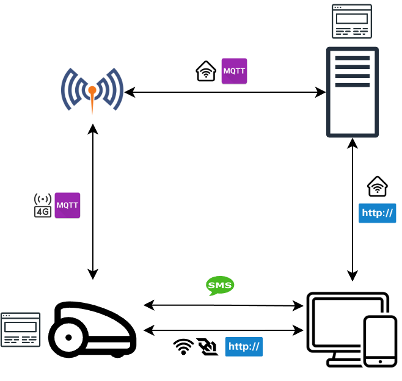

# BladeOfGrass-mower
## Overview
### Project Name:
Blade of Grass (BoG)

### Objective:
Develop a fully autonomous robot mower that cuts grass based on a predefined GPS boundary and schedule. The mower adapts to weather conditions using onboard sensors and internet data, while providing user control via a web interface and emergency alerts via SMS.

### Features:
#### Robot:
- Autonomous operation: 
	- Operates within a GPS-defined boundary
	- Runs on a schedule
	- Adapts schedule based on weather
- Manual control
- Communication:
	- 4G (RTK, robot-server)
	- SMS (Emergency)
	- Local AP (robot-user)
- Onboard data logging
- GPS boundary setup
- RTK rower
#### Server:
- Data storage
- Admin dashboard web server
- RTK base station

#### User: 
- Single user (prototype phase)
- Setup procedure 
- Monitoring
- Control
- SMS receiving

### High-Level Architecture:

    

#### Robot:
The ESP32-S3-based autonomous mower features sensors, 4G and Wi-Fi AP connectivity, an onboard display, emergency hardware, RTK capabilities, and an onboard admin website for configuration and monitoring.
#### Server:
The ESP32-S3-based server, kept at home, functions as a data logger, RTK base station, and intermediary between the user and robot, with connections to home Wi-Fi and an onboard admin website for configuration and monitoring.
#### User:
The user interacts with the system through a web browser interface to control, monitor, and configure the robot, connecting via home Wi-Fi to the server and the robot’s AP for local access, while receiving SMS emergency notifications.

